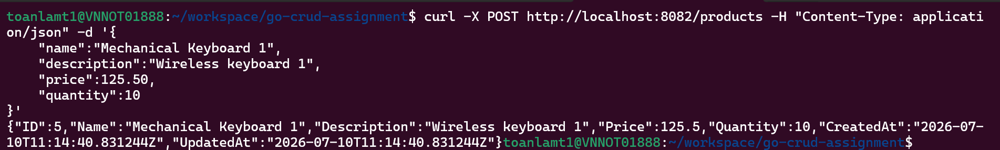
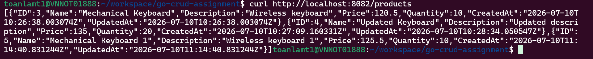
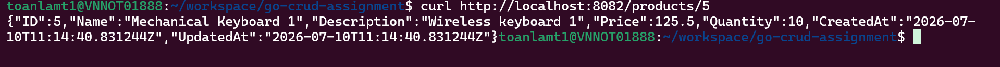
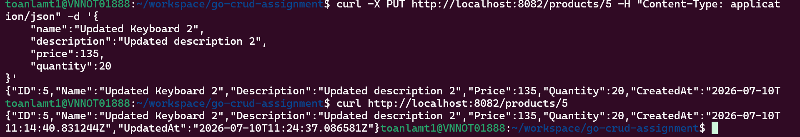
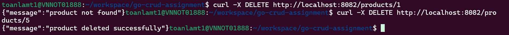
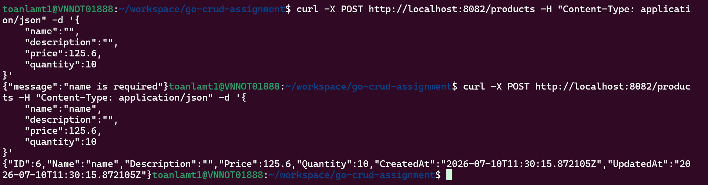

# Product Management API

A simple REST API built with Go, Gin, and PostgreSQL for managing products.

This project demonstrates:

- Go project structure
- REST API development
- PostgreSQL integration
- CRUD operations
- Repository pattern
- Service layer
- Input validation
- Database migration
- Unit testing

---

## Tech Stack

- Go
- Gin Framework
- PostgreSQL
- golang-migrate
- Makefile

---

## Project Structure

```text
go-crud-assignment/
│
├── config/
│   └── config.go
│
├── internal/
│   ├── handlers/
│   │   └── product_handler.go
│   │
│   ├── infrastructure/
│   │   └── database.go
│   │
│   ├── models/
│   │   └── product.go
│   │
│   ├── repositories/
│   │   ├── repository.go
│   │   └── product_repository.go
│   │
│   ├── routes/
│   │   └── routes.go
│   │
│   └── services/
│       └── product_service.go
        └── service.go
│
├── migrations/
│   ├── 001_create_products_table.up.sql
│   └── 001_create_products_table.down.sql
│
├── screenshots/
│
├── .env.example
├── .gitignore
├── Makefile
├── go.mod
├── go.sum
├── main.go
└── README.md

---

# Prerequisites

Install the following tools:

- Go
- PostgreSQL
- golang-migrate
- Make

Check installation:

```bash
go version

psql --version

migrate -version

make --version
```

---

# Environment Configuration

The project uses environment variables for database configuration.

Create your local environment file:

```bash
cp .env.example .env
```

Example `.env`:

```env
DB_HOST=localhost
DB_PORT=5432
DB_USER=user
DB_PASSWORD=password
DB_NAME=dbname
DB_SSLMODE=disable
```

Do not commit `.env` file.

The `.env` file is ignored by Git.

---

# Database Setup

## Create Database

Login to PostgreSQL:

```bash
sudo -u postgres psql
```

Create database:

```sql
CREATE DATABASE dbname;
```

Create database user:

```sql
CREATE USER user1 WITH PASSWORD 'password';
```

Grant permission:

```sql
GRANT ALL PRIVILEGES
ON DATABASE dbname
TO user1;
```

Exit:

```sql
\q
```

---

# Database Migration

This project uses `golang-migrate` to manage database schema changes.

Migration files are located in:

```
migrations/
```

Example:

```
001_create_products_table.up.sql
001_create_products_table.down.sql
```

---

## Run Migration

Apply all pending migrations:

```bash
make migrate-up
```

Example output:

```
1/u create_products_table
```

---

## Rollback Migration

Rollback the latest migration:

```bash
make migrate-down
```

---

# Makefile Commands

The project provides common development commands.

| Command | Description |
|---|---|
| `make run` | Start application |
| `make build` | Build project |
| `make test` | Run unit tests |
| `make fmt` | Format Go code |
| `make tidy` | Clean dependencies |
| `make migrate-up` | Run database migration |
| `make migrate-down` | Rollback migration |

---

# Install Dependencies

Run:

```bash
make tidy
```

or:

```bash
go mod tidy
```

---

# Run Application

Start API server:

```bash
make run
```

or:

```bash
go run main.go
```

The server will start at:

```
http://localhost:8080
```

---

# API Documentation

Base URL:

```
http://localhost:8080
```

---

# Create Product

## Endpoint

```
POST /products
```

## Request

```json
{
    "name": "Mechanical Keyboard",
    "description": "Wireless mechanical keyboard",
    "price": 120.50,
    "quantity": 10
}
```

## Curl

```bash
curl -X POST http://localhost:8080/products \
-H "Content-Type: application/json" \
-d '{
    "name": "Mechanical Keyboard",
    "description": "Wireless mechanical keyboard",
    "price": 120.50,
    "quantity": 10
}'
```

## Response

```json
{
    "id": 1,
    "name": "Mechanical Keyboard",
    "description": "Wireless mechanical keyboard",
    "price": 120.50,
    "quantity": 10,
    "created_at": "2026-06-21T10:00:00Z",
    "updated_at": "2026-06-21T10:00:00Z"
}
```

---

# Get Product List

## Endpoint

```
GET /products
```

## Curl

```bash
curl http://localhost:8080/products
```

---

# Get Product Detail

## Endpoint

```
GET /products/:id
```

Example:

```
GET /products/1
```

## Curl

```bash
curl http://localhost:8080/products/1
```

---

# Update Product

## Endpoint

```
PUT /products/:id
```

## Request

```json
{
    "name": "Updated Keyboard",
    "description": "Updated description",
    "price": 135,
    "quantity": 15
}
```

## Curl

```bash
curl -X PUT http://localhost:8080/products/1 \
-H "Content-Type: application/json" \
-d '{
    "name": "Updated Keyboard",
    "description": "Updated description",
    "price": 135,
    "quantity": 15
}'
```

---

# Delete Product

## Endpoint

```
DELETE /products/:id
```

## Curl

```bash
curl -X DELETE http://localhost:8080/products/1
```

## Response

```json
{
    "message": "product deleted successfully"
}
```

---

# Validation

The API validates:

## Name

Rules:

- Required
- Minimum 3 characters

Example:

```json
{
    "message": "name is required"
}
```

---

## Price

Rules:

- Required
- Greater than 0

Example:

```json
{
    "message": "price must be greater than 0"
}
```

---

## Quantity

Rules:

- Required
- Greater than or equal to 0

Example:

```json
{
    "message": "quantity must be greater than or equal to 0"
}
```

---

# Unit Testing

Run all tests:

```bash
make test
```

or:

```bash
go test ./...
```

Run with verbose output:

```bash
go test -v ./...
```

---

# Code Quality

Before committing code:

Format:

```bash
make fmt
```

Update dependencies:

```bash
make tidy
```

Build:

```bash
make build
```

Run tests:

```bash
make test
```

---

# Database Verification

Connect database:

```bash
psql -U goapp -d productdb
```

Check tables:

```sql
\dt
```

Expected:

```
products
schema_migrations
```

View products:

```sql
SELECT * FROM products;
```

---

# Screenshots

## Create Product



## Get Product List



## Get Product Detail



## Update Product



## Delete Product



## Validation Error



---

# Development Workflow

For a new developer:

```bash
git clone <repository>

cd go-crud-assignment

cp .env.example .env

make migrate-up

make run
```

Test API:

```bash
curl http://localhost:8080/products
```

---

# Common Errors

## Database connection failed

Check:

```env
DB_HOST
DB_PORT
DB_USER
DB_PASSWORD
DB_NAME
```

---

## Migration already applied

Check migration status:

```bash
migrate \
-path migrations \
-database "$DATABASE_URL" version
```

---

## Port 8080 already in use

Find process:

```bash
sudo lsof -i :8080
```

Kill process:

```bash
kill <PID>
```